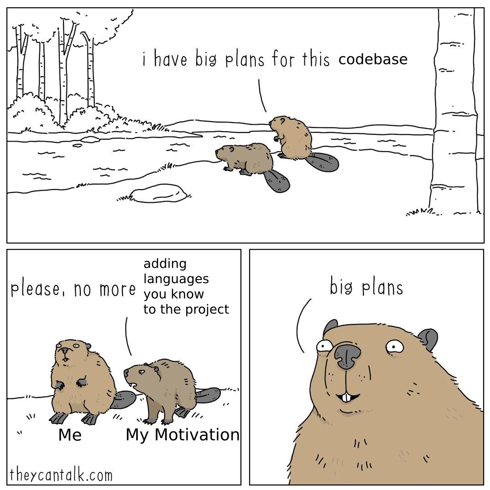

# The discipline of learning [WIP]

## General Overview
Hello dear reader. This project is meant to be a multiservice platform to showcase my knowledge on the used technologies. I started the development in Golang and it has proven quite the challenge. It may be because it feels so different to the rest of the languages I know and have worked with but the difficulty killed my motivation. The learning process has been interesting and Golang is quite appealing and clean with but a few cases.

This project is meant to be a multiservice platform where each service handles a module (basically a resource/entity CRUD).   
What I am trying to accomplish is to make a project made up of many different languages and tools on which I have knowledge of.

The languages:
* Golang
* Php
* Python
* Typescript
* Mysql query language

The tools:
* Docker

## Setup
WIP

The dev version of the docker compose file is fully tested and working.
